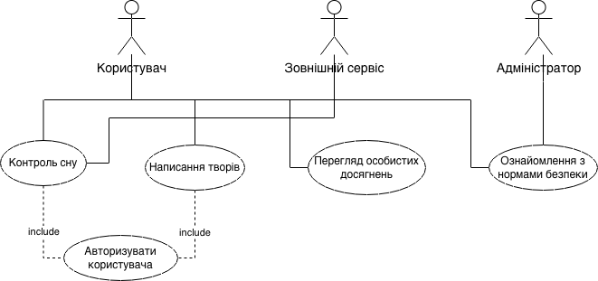

### Вимоги користувача до програмного продукту

#### 1. Перелік акторів (Actors)

1. **Користувач (Письменник):** основний актор, який використовує систему для моніторингу режиму 
відпочинку, ознайомлення з нормами безпеки праці, ведення творчої діяльності та відстеження особистого 
статусу.
2. **Зовнішній сервіс моніторингу здоров'я:** зовнішня система (API), що надає дані про фази та тривалість 
сну користувача для подальшого аналізу.
3. **Адміністратор бази знань:** відповідальний за актуалізацію нормативної інформації щодо безпеки праці 
та модерацію системи досягнень.

#### 2. Діаграма прецедентів (UML Use Case Diagram)

#### 3. Перелік прецедентів (Use Cases)

- **UC-1: Аналіз якості відпочинку.** Надання користувачу візуалізованої статистики сну та рекомендацій 
щодо відновлення сил.
- **UC-2: Ознайомлення з нормами безпеки праці.** Доступ до структурованої бази знань щодо організації 
безпечного робочого місця та режиму праці.
- **UC-3: Управління творчими проєктами.** Інструментарій для створення художніх творів, ведення обліку 
прогресу та планування творчих етапів.
- **UC-4: Моніторинг особистих досягнень.** Система фіксації успіхів користувача для задоволення потреби у 
повазі та соціальному визнанні.
- **UC-5: Коригування творчого плану.** Автоматичне формування пропозицій щодо зміни інтенсивності роботи 
на основі поточної якості сну та фізичного стану.
