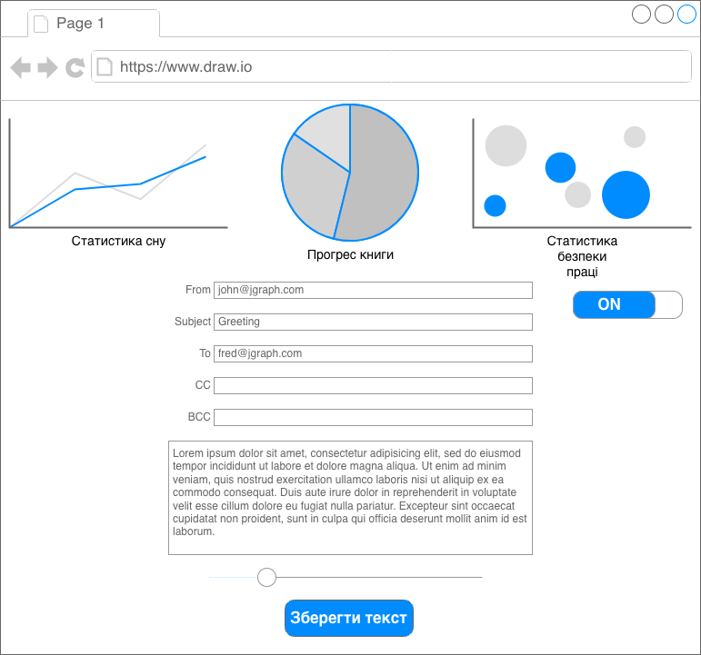

# Нефункціональні вимоги до виведення даних

### 1. Ескіз інтерфейсу (Wireframe)
Нижче представлено макет головного екрана системи, що об'єднує модулі сну, творчості та безпеки.

### 2. Графічний інтерфейс користувача (GUI)
* **Адаптивність:** Інтерфейс має коректно працювати на мобільних пристроях та десктопах.
* **Темна тема:** Обов'язкова підтримка нічного режиму для комфортної роботи письменника.

### 3. Візуалізація даних
* **Графіки сну:** Використання діаграм для відображення фаз відпочинку.
* **Прогрес-бари:** Візуалізація щоденної цілі з написання тексту.
* **Колірна індикація безпеки:** Зелений/Жовтий/Червоний рівні втоми.
