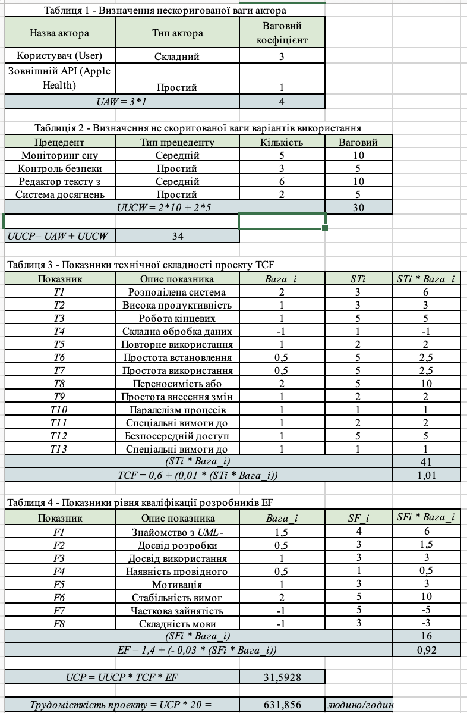

# Оцінка трудомісткості за методом Use Case Points

Цей розділ містить розрахунок трудовитрат на розробку системи персонального помічника для письменника (Варіант 8).

### 1. Параметри оцінки
* **Unadjusted Actor Weight (UAW):** 4 (Користувач як Complex + Зовнішній API як Simple).
* **Unadjusted Use Case Weight (UUCW):** 30 (на основі 4 основних функцій: 2 Average та 2 Simple).
* **Unadjusted Use Case Points (UUCP):** 34.
* **Technical Complexity Factor (TCF):** 1.01.
* **Environmental Factor (EF):** 0.92.
* **Total Use Case Points (UCP):** 31.59.

### 2. Результат розрахунку часу
Згідно з методом UCP (при коефіцієнті продуктивності PF = 20), орієнтовний час на реалізацію проєкту складає:
**631.86 людино/годин.**

### 3. Скріншот розрахунку

